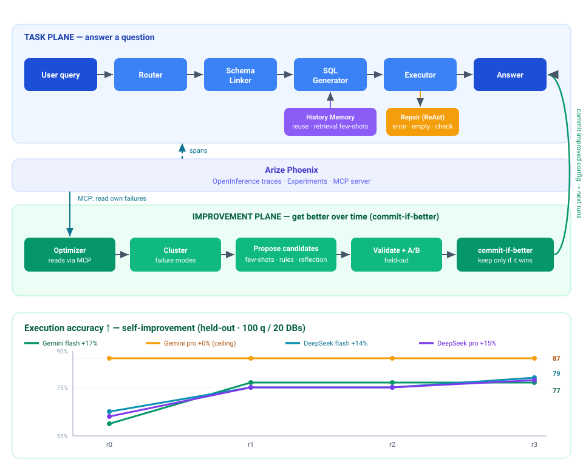

# 🔁 SQLoop — a self-improving text-to-SQL agent

SQLoop turns natural-language questions into SQL **and improves itself**. It isn't
just "NL → SQL": an Optimizer reads the agent's *own* execution traces through the
**Arize Phoenix MCP server**, clusters its failure modes, proposes prompt / few-shot
changes, A/B-validates them on a held-out set, and **keeps a change only if it wins**.
The result is a rising execution-accuracy curve produced entirely by the agent.

Built for the **Google Cloud Rapid Agent Hackathon (Arize track)** with Google ADK +
Gemini, OpenInference tracing to Phoenix, and the Phoenix MCP server.

## Why it's interesting

- **A real closed loop**, not a single pass: trace → diagnose → propose → validate → commit-if-better.
- **Deep tracing + MCP**: every Router/Schema-Linker/Generator/Executor/Repair step is a Phoenix span; the Optimizer pulls its own experiment results back *via MCP*.
- **Evidence, not vibes**: Spider-style execution accuracy with 95% confidence intervals, and a **significance gate** so single-point noise never gets committed.

Self-improvement result (DeepSeek dev validation, 100 held-out questions / 20 DBs, seed 13,
greedy decoding, commit gate = +3 examples):

| round | 0 (baseline) | 1 | 2 | 3 |
|------|------|------|------|------|
| flash | 65% (CI 55–74) | 75% | 75% | **79%** (CI 70–86) |
| pro   | 63% (CI 53–72) | 75% | 75% | **78%** (CI 70–86) |

Both models gain **+14–15%** and end statistically tied (differences within the 95% CIs).
The commit gate **correctly rejects the round-2 candidate** (+1–2 examples = noise) in both
runs, so the curve rises only on *meaningful* wins. Gains come from *transferable* learned
rules / retrieved few-shots, so they generalize across databases. Cost: ~3.5k tokens /
generation (grows ~30% as the prompt accumulates rules/few-shots).

## Architecture



- **Dataset / metric**: Spider; execution accuracy (result-set match, column-order-insensitive, 95% CI).
- **Task plane**: heuristic/LLM router, schema linking with **value linking**, single-pass generation, conditional ReAct repair (error / empty / LLM self-check) with a loop guard, optional history memory.
- **Improvement plane**: MCP-grounded failure analysis → additive prompt/few-shot candidates → validation ranking → held-out A/B with a **commit-if-better significance gate**; each round logged to Phoenix Experiments.

## Quickstart

```bash
# 1. install (uv). If the configured mirror times out, append:
#    --index-url https://pypi.org/simple
uv sync

# 2. configure secrets
cp .env.example .env        # fill GOOGLE_API_KEY + PHOENIX_* (see comments)

# 3. download the Spider dataset (~200 MB) into data/spider/
uv run gdown 1403EGqzIDoHMdQF4c9Bkyl7dZLZ5Wt6J -O data/spider.zip
unzip -q data/spider.zip -d data/_x && mv data/_x/spider_data data/spider && rm -rf data/_x data/spider.zip

# (optional, for the Day-1 toy DB used by `main.py` with no db_id)
uv run python seed_db.py
```

## Usage

```bash
# Ask one question (NL → SQL → result), traced to Phoenix
uv run python main.py "How many singers do we have?" concert_singer

# Baseline execution accuracy on a Spider sample (+95% CI)
uv run python run_eval.py 20

# Log an experiment to Phoenix Experiments (dataset + task + evaluator)
uv run python run_experiment.py 20 "baseline"

# Optimizer: read your own failures via Phoenix MCP → failure-mode report
uv run python run_optimizer.py

# One self-improvement round (propose → validate → A/B → commit-if-better)
uv run python run_improve.py

# Full multi-round rising curve  (writes data/curve.json)
uv run python run_loop.py 3 --multidb

# Dashboard: Q&A + the accuracy curve + failure-mode report
uv run python app.py            # http://127.0.0.1:7860
```

### Phoenix MCP usage

The Optimizer (`sqloop/optimizer.py`) launches the Phoenix MCP server
(`npx @arizeai/phoenix-mcp`) and uses its tools — `list-datasets`,
`list-experiments-for-dataset`, `get-experiment-by-id` — to pull the agent's own
experiment results, then a single Gemini call clusters the failures into a report.
Fetch (MCP) and analysis (LLM) run in two phases so the agent never has to hold
both connections at once.

> Note: `@arizeai/phoenix-mcp` is a Node app; set `NODE_USE_ENV_PROXY=1` if you are
> behind an HTTP proxy (handled automatically in `optimizer.py`).

## LLM backend

- **Default = Gemini** (the submission backend; runs on Vertex AI — see `.env.example`).
- **`LLM_BACKEND=deepseek`** routes through LiteLLM to DeepSeek for *dev validation
  only* (reachable without a proxy, no free-tier rate limit). All submission numbers
  are produced on Gemini.

## Project layout

Flat `sqloop/` package, grouped by role — the two planes from the architecture above:

```
Task plane  (answer a question):
  agent.py          pipeline (build_pipeline) + Gemini/DeepSeek backend switch
  router.py         intent router: heuristic (no-LLM) or LLM
  schema_link.py    relevant-table retrieval (+FK closure, value linking)
  schema_linker.py  ADK agent wrapper for the above
  db.py             SQLite executor (execute_sql tool)
  repair.py         conditional ReAct repair (error / empty / LLM self-check)
  prompts.py        agent instructions
  memory.py         history memory: reuse + adaptive hybrid retrieval

Improvement plane  (improve the agent):
  optimizer.py      Phoenix MCP fetch + failure-mode analysis (+ report distill)
  propose.py        candidate-pool proposer (GEPA/MIPRO-style, additive)
  loop.py           one round: reflect → propose → rank → A/B → commit-if-better
  config.py         swappable GeneratorConfig (prompt + few-shots)

Eval / observability:
  eval.py           Spider-style execution match + Wilson CI + commit gate
  experiment.py     log each round to Phoenix Experiments
  spider.py         Spider dataset access
  throttle.py       rate-limit backoff
  instrumentation.py  Phoenix tracing setup

Drivers:  main.py  run_eval.py  run_experiment.py  run_optimizer.py
          run_improve.py  run_loop.py  build_memory.py  app.py  seed_db.py
```

### Configuration (env switches)

All optional, with safe defaults — batch-eval / serve behaviour is tunable without code changes.

| switch | default | effect |
|--------|---------|--------|
| `LLM_BACKEND` | `gemini` | `deepseek` routes via LiteLLM (dev validation only) |
| `SQLOOP_ROUTER` | `llm` | `heuristic`/`skip` drop the per-turn router LLM call (~⅓ of calls); the loop defaults to `heuristic` |
| `SQLOOP_REPAIR` | `basic` | `empty` adds empty-result repair; `verify` adds an LLM result self-check |
| `SQLOOP_SCHEMA_VALUES` | `on` | value linking (sampled cell values fold into table scoring) |
| `SQLOOP_COMMIT_RULE` / `_MIN_GAIN` | `margin` / `3` | commit gate: candidate must win by ≥N held-out examples (`strict` = old single-point) |
| `SQLOOP_PROPOSE_DEMOS` | `on` | `off` lets History Memory own the few-shot lane (no duplication) |
| `SQLOOP_PHOENIX_EXPERIMENTS` | `off` | `on` logs each round's curve point to Phoenix Experiments |
| `SQLOOP_OPTIMIZER_LIVE` | `off` | `on` fetches the failure report live via MCP each loop |

## License

MIT — see [LICENSE](LICENSE).
